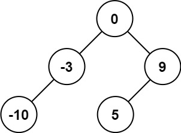
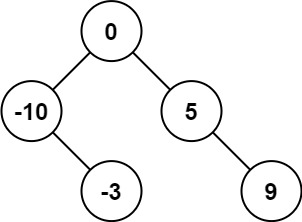
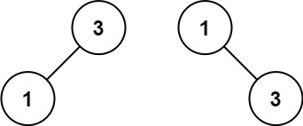

# Problem 108: Convert Sorted Array to Binary Search Tree
Difficulty: Easy
Category: Array, Trees
Approach: Recursion (repeats itself)

# Goal
- Given an array sorted in ascending order (smallest to largest)  
- Convert the array into a **height-balanced binary search tree (BST)**

### Binary Tree:
- A tree where each node can have at most two children:
  - **Left child** → number/node on the left branch  
  - **Right child** → number/node on the right branch  
  - **Parent** → node above left and right children  
    - The **root** is the top-most node (starting point of the tree)  
- **Subtree:** the tree formed by any node and all of its descendants below it

### Binary Search Tree (BST):
- A type of binary tree with an ordering rule: left < parent < right
  - All numbers in the **left part of a node** (left subtree) are **less than** the node’s value  
  - All numbers in the **right part of a node** (right subtree) are **greater than** the node’s value  
  - This rule applies **recursively** for every node in the tree

### Height-Balanced:
- The tree is “evenly balanced” so that:
  - The **left and right parts of any node** (left and right subtrees) differ in height by at most 1  

# Example
Example 1:

    Input: nums = [-10,-3,0,5,9]
    Output: [0,-3,9,-10,null,5]
    Explanation:
    [0,-10,5,null,-3,null,9] is also accepted

Example 2:

    Input: nums = [1,3]
    Output: [3,1]
    Explanation: 
    [1,null,3] and [3,1] are both height-balanced BSTs.

# Approach  
1. Pick middle of array → root (keeps tree balanced)  
2. Left side → build left subtree (recursive)  
3. Right side → build right subtree (recursive)  
4. Stop when no numbers left → base case 